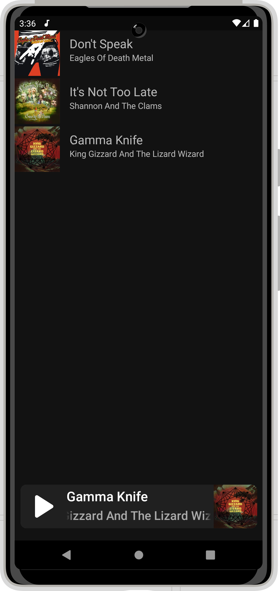
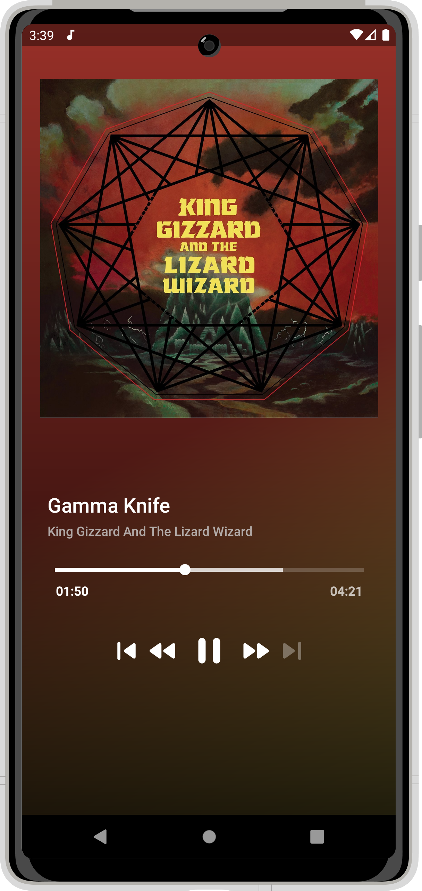
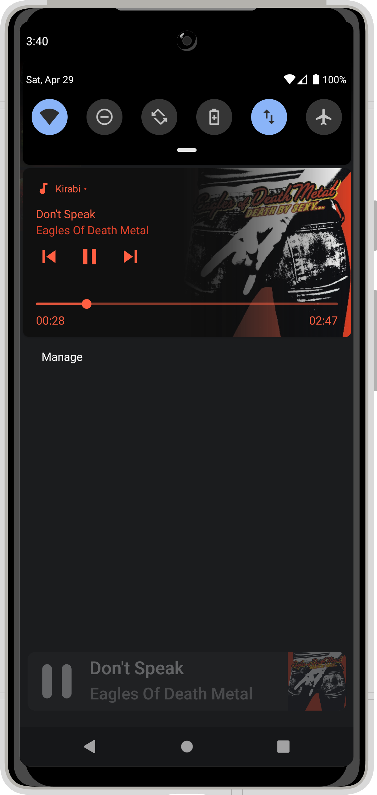

<h1 align="center">Kirabi</h1>

  
Playground to test exoplayer2, particularly its StyledPlayerView and PlayerNotificationManager. Also to emulate some features of the Spotify interface.
Kirabi is an app that plays music stored in Firebase. It is based on the https://github.com/philipplackner/SpotifyCloneYT and https://github.com/android/uamp projects.

 

   

## Tech stack & Open-source libraries
- ViewBinding - Allows to more easily write code that interacts with views.
- ViewModel - State Holder. Responsible for the production of UI state, contains the necessary logic for that task.
- Lifecycle - Lifecycle-aware components.
- Navigation - In-app navigation.
- SafeArgs - Passing data while navigating between fragments.
- Kotlin Coroutines - A concurrency design pattern to simplify code that executes asynchronously.
- [Palette](https://developer.android.com/jetpack/androidx/releases/palette) - A helper class to extract prominent colors from an image.
- [Exoplayer 2](https://exoplayer.dev/) - ExoPlayer is an application level media player for Android. It provides an alternative to Android’s MediaPlayer API for playing audio and video both locally and over the Internet.
- [Firebase Firestore](https://firebase.google.com/products/firestore) - Cloud Firestore is a NoSQL document database that lets you easily store, sync, and query data for your mobile and web apps - at global scale.
- [Firebase Storage](https://firebase.google.com/products/storage) - Cloud Storage is designed to help you quickly and easily store and serve user-generated content, such as photos and videos.
- [Rainbow](https://github.com/skydoves/Rainbow) - Fluent syntactic sugar of Android for applying gradations, shading, and tinting.
- [Dagger-Hilt](https://dagger.dev/hilt/gradle-setup) - Dependency injection.
- [Glide](https://github.com/bumptech/glide) - Image loading.

## Preview
